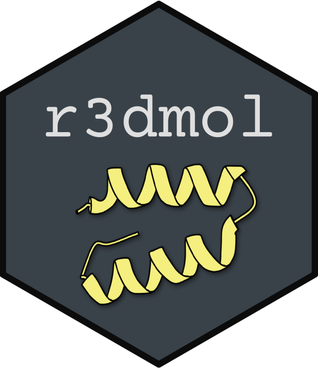

<!-- README.md is generated from README.Rmd. Please edit that file -->

# r3dmol 

<!-- badges: start -->

[](https://CRAN.R-project.org/package=r3dmol)
[](https://codecov.io/gh/swsoyee/r3dmol?branch=master)
[](https://github.com/swsoyee/r3dmol/actions)
[](https://lifecycle.r-lib.org/articles/stages.html#experimental)
[](https://cran.r-project.org/package=r3dmol)
<!-- badges: end -->

This is an R package that provides support for
[`3Dmol.js`](https://3dmol.csb.pitt.edu/index.html) as a
[`htmlwidgets`](https://www.htmlwidgets.org/).

## Installation

> **Important**: This package is still very early in its development
> stages. Please give the repository a star on Github if you find the
> package is useful. In addition, we need your feedback to improve the
> package, feel free to create an issue if you have any question or
> feature requirement. You are more than welcome to submit a PR to make
> any feasible improvements.

You could install the released version of r3dmol from
[CRAN](https://CRAN.R-project.org) with:

``` r
install.packages("r3dmol")
```

And the development version from [GitHub](https://github.com/) with:

``` r
# install.packages("devtools")
devtools::install_github("swsoyee/r3dmol")
```

## Example

``` r
library(r3dmol)

r3dmol(                         # Set up the initial viewer
  viewer_spec = m_viewer_spec(
    cartoonQuality = 10,
    lowerZoomLimit = 50,
    upperZoomLimit = 350
  )
) %>%
  m_add_model(                  # Add model to scene
    data = pdb_6zsl,
    format = "pdb"
  ) %>%
  m_zoom_to() %>%               # Zoom to encompass the whole scene
  m_set_style(                  # Set style of structures
    style = m_style_cartoon(
      color = "#00cc96"
    )
  ) %>%
  m_set_style(                  # Set style of specific selection
    sel = m_sel(ss = "s"),      # (selecting by secondary)
    style = m_style_cartoon(
      color = "#636efa",
      arrows = TRUE
    )
  ) %>%
  m_set_style(                  # Style the alpha helix
    sel = m_sel(ss = "h"),      # (selecting by alpha helix)
    style = m_style_cartoon(
      color = "#ff7f0e"
    )
  ) %>%
  m_rotate(                     # Rotate the scene by given angle on given axis
    angle = 90,
    axis = "y"
  ) %>%
  m_spin()                      # Animate the scene by spinning it
```

  
You can find more demo at
[here](https://swsoyee.github.io/r3dmol/articles/r3dmol.html).

## About `3Dmol.js`

> Nicholas Rego, David Koes, [3Dmol.js: molecular visualization with
> WebGL](https://academic.oup.com/bioinformatics/article/31/8/1322/213186),
> Bioinformatics, Volume 31, Issue 8, 15 April 2015, Pages 1322–1324,

## Code of Conduct

Please note that the r3dmol project is released with a [Contributor Code
of
Conduct](https://contributor-covenant.org/version/2/0/CODE_OF_CONDUCT.html).
By contributing to this project, you agree to abide by its terms.
